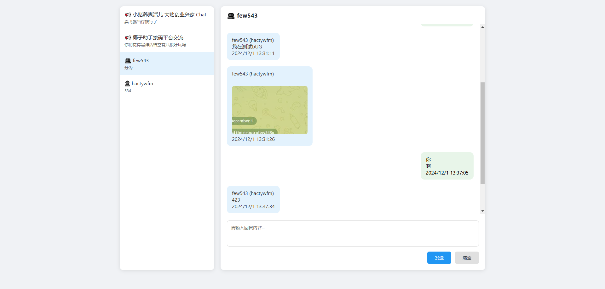

# Telegram 消息监听系统

一个基于 Node.js 的 Telegram 消息监听和管理系统，支持实时消息接收、发送、图片查看等功能。

## 加入我们

欢迎加入我们的 Telegram 群组：[翻斗花园](https://t.me/a645645654)

## 软件截图

## 功能说明

### 消息列表
- 左侧显示所有聊天列表
- 未读消息显示提示标记
- 支持置顶聊天（右键菜单）
- 显示最后一条消息预览

### 消息显示
- 支持文本和图片消息
- 点击图片可放大查看
- 显示发送时间和发送者
- 区分发送和接收的消息

### 消息发送
- 支持文本消息发送
- Enter 键快捷发送
- Shift + Enter 换行

### 其他功能
- 已读/未读状态同步
- 聊天置顶功能
- 暗黑模式支持
- 图片消息预览

## 使用说明

1. 首次运行需要进行 Telegram 账号登录
2. 登录后会自动保存会话信息
3. 左侧列表显示所有聊天
4. 点击聊天进入对话
5. 右键聊天可以置顶
6. 点击图片可以放大查看
7. 在输入框输入消息并发送

## 注意事项

1. 请妥善保管 API 凭据
2. 首次登录需要输入手机号和验证码
3. 图片文件会保存在 uploads 目录
4. 消息历史记录保存在 SQLite 数据库中

## 技术栈

- 后端：Node.js + Express + Socket.IO
- 数据库：SQLite3
- 前端：原生 JavaScript + Socket.IO Client
- API：Telegram API

## 开发说明

### 添加新功能
1. 在相应的 JS 文件中添加功能代码
2. 保持代码结构的清晰和模块化
3. 注意全局变量的使用

### 样式修改
1. 修改 `static/css/style.css`
2. 注意保持暗黑模式的兼容

### 数据库修改
1. 在 `server.js` 中修改数据库结构
2. 注意数据迁移和兼容性

## 联系我们

- Telegram 群组：[@翻斗花园](https://t.me/a645645654)
- 订阅人数：36+

## 贡献指南

欢迎提交 Pull Request 或 Issue，也欢迎加入我们的 Telegram 群组参与讨论！

## 许可证

MIT License

## 特别感谢

感谢所有贡献者和群组成员的支持！
